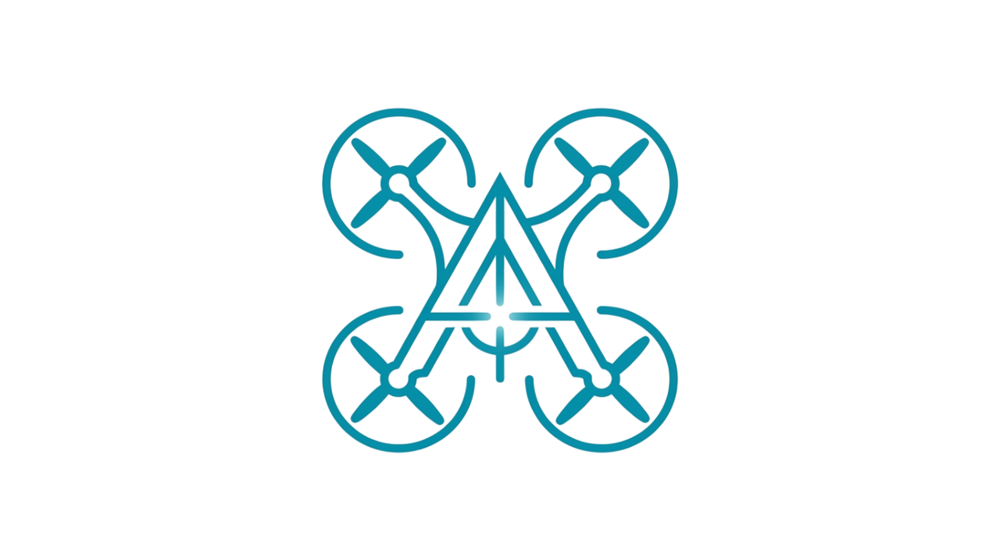
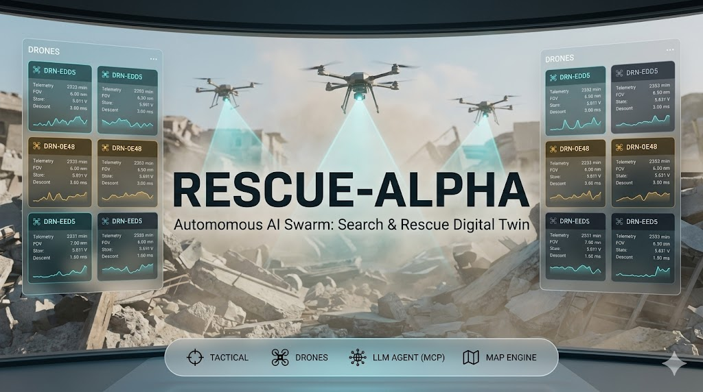
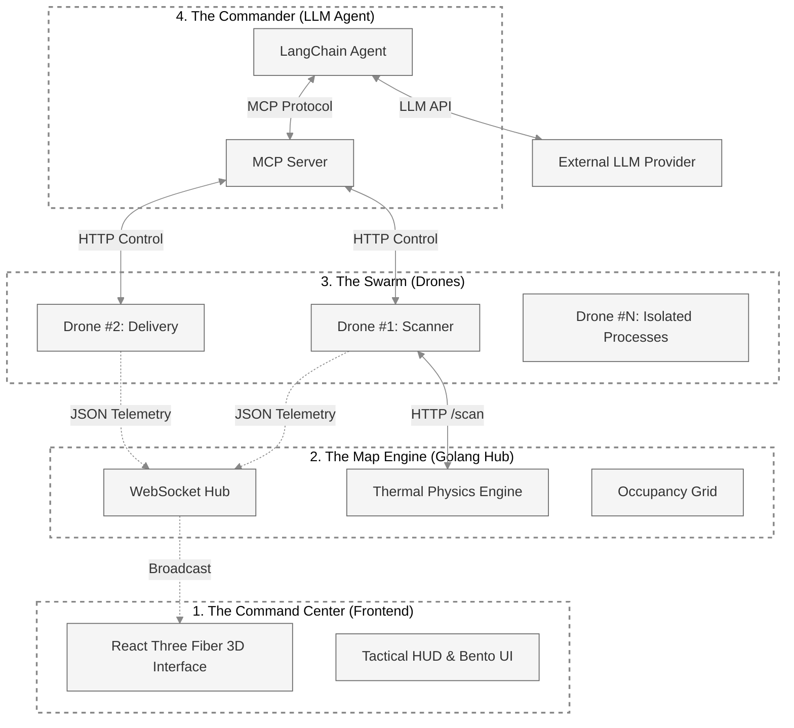

# RESCUE-ALPHA
### Autonomous Search & Rescue Digital Twin

<p align="center">
  
</p>

<p align="center">
  
</p>

<p align="center">
  <a href="https://go.dev"></a>
  <a href="https://react.dev"></a>
  <a href="https://threejs.org"></a>
  <a href="https://www.typescriptlang.org"></a>
  <a href="https://modelcontextprotocol.io"></a>
</p>

---

## Executive Summary
**RESCUE-ALPHA** is a high-performance, distributed simulation system designed for autonomous earthquake disaster response. It utilizes a state-of-the-art **4-node architecture** that synchronizes real-time 3D visualization, high-concurrency telemetry handling, and LLM-driven autonomous orchestration via the Model Context Protocol (MCP).

The system enables a fleet of heterogeneous drones (Scanners and Delivery units) to systematically search for human heat signatures in rubble fields, navigate complex obstacles using A* pathfinding, and deliver life-saving aid—all without human intervention.

---

## System Architecture

RESCUE-ALPHA operates on two primary planes: the **Telemetry Plane** (Spatial Synchronization) and the **Control Plane** (Autonomous Orchestration).



### The Four Pillars
1.  **[The Command Center (Frontend)](frontend/README.md)**: A React-based 3D digital twin of the disaster zone, featuring a triple-view camera system (Global, Follow, Pilot) and real-time thermal heatmap rendering.
2.  **[The Map Engine (drone-sim-server)](drone-sim-server/README.md)**: A high-concurrency Golang WebSocket hub utilizing non-blocking I/O to handle 100Hz+ telemetry streams with zero backpressure.
3.  **[The Swarm (drone-processes)](drone/README.md)**: Isolated Python processes simulating physical hardware, A* navigation, and 3D conical FOV (Field of View) thermal detection.
4.  **[The Commander (backend)](backend/README.md)**: An LLM-powered orchestration engine that communicates via the Model Context Protocol (MCP) to manage the fleet as a set of autonomous tools.

---

## Orchestration Guide

### Prerequisites
- **Go 1.21+** (Map Engine)
- **Node.js 18+** (Frontend)
- **Python 3.11+** (Drones & Agent)
- **LLM API Key** (DeepSeek, Gemini, OpenAI, or Anthropic)

### Startup Sequence
To ensure proper handshaking between nodes, start the services in the following order:

1.  **Map Engine**: `cd drone-sim-server && go run main.go --server`
2.  **Drone Swarm**: Start as many drones as needed in separate terminals.
    - `cd drone && python main.py` (Default: Scanner at port 8001)
    - `DRONE_TYPE=delivery DRONE_PORT=8002 python main.py`
3.  **Commander Agent**: `cd backend && uvicorn backend.main:app --port 8000`
4.  **Command Center**: `cd frontend && npm run dev`

### Automated Deployment (Windows)
```powershell
.\dev.ps1 -Setup  # Install all dependencies and create venvs
.\dev.ps1         # Launch all 5+ terminals automatically
```

---

## Core Technologies

| Layer | Stack | Key Features |
|-------|-------|--------------|
| **Frontend** | React, R3F, Drei, Zustand | Transient Ref Pattern, Triple-View Camera, Bento UI |
| **Sim Server** | Go, lxzan/gws | Non-blocking WebSocket Hub, Non-pressure Telemetry |
| **Drone AI** | Python, FastAPI, A* | Conical FOV simulation, Battery management, Lawnmower search |
| **Command Agent** | Python, LangChain, MCP | Model Context Protocol, Chain-of-Thought Reasoning |

---

## Component Deep Dives

- **[Architecture & Orchestration (Backend)](backend/README.md)**
- **[3D Visualization (Frontend)](frontend/README.md)**
- **[Telemetry Hub (Go Sim Server)](drone-sim-server/README.md)**
- **[Drone Simulation (Python Swarm)](drone/README.md)**

---

