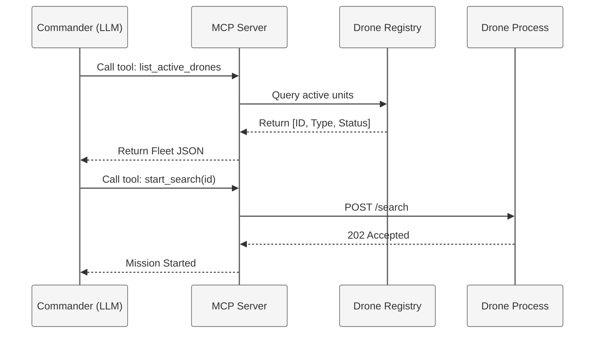
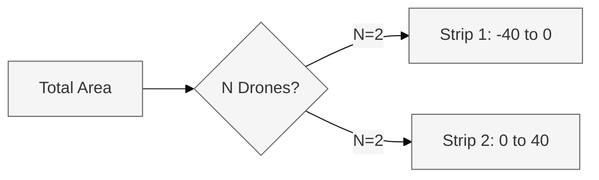
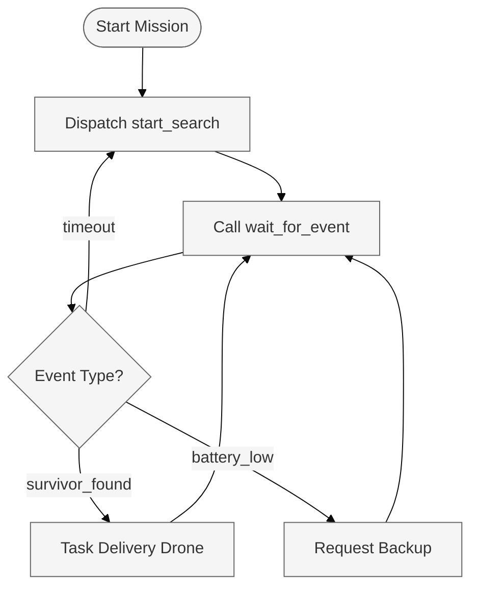

# The Commander (RESCUE-ALPHA)
### Autonomous LLM Orchestration & MCP Server

The Commander is the high-level cognitive layer of the RESCUE-ALPHA system. It leverages the **Model Context Protocol (MCP)** to interface with the Drone Swarm as a set of standardized, discoverable tools. Through this architecture, an LLM agent performs autonomous reasoning, mission planning, and real-time response to disaster events.

---

## Technical Architecture

The Commander operates as a **FastAPI-based MCP Server**. It manages an in-memory **Drone Registry** that catalogues every individual drone's UUID, type, and capabilities. The orchestration is performed by a LangChain-based ReAct agent utilizing Chain-of-Thought (CoT) reasoning.



### Key Features
- **Discovery Architecture**: Dynamically detects drones as they register on the network.
- **MCP Tool Definitions**: Exposes 13+ low-level drone functions as simplified, high-level tools for the LLM.
- **Event-Driven Reactivity**: Processes asynchronous events from the fleet (e.g., `survivor_found`, `battery_low`) using a non-blocking queue.
- **Heterogeneous Tasking**: Orchestrates Scanners (thermal search) and Delivery units (aid drops) in a unified mission flow.

---

## Mission Protocol (The Reasoner)

The LLM agent follows a structured four-phase protocol to ensure maximum survival probability and power efficiency.

### Sector Partitioning Algorithm
To avoid collisions and ensure 100% coverage, the Commander implements a **Vertical Strip Partitioning** strategy.
1. **Grid Analysis**: Retrieves the global map boundaries (e.g., -40 to 40).
2. **Strip Calculation**: Divides the total width by the number of active drones ($W_{strip} = TotalWidth / N$).
3. **Task Allocation**: Assigns each drone a unique $(x1, y1, x2, y2)$ bounding box.



### Mission Control: The Event Loop
The agent is not a static script but a **Reactive Loop**. It uses a non-blocking queue to process incoming WebSocket events from the Map Engine via the MCP `wait_for_event` tool.



| Phase | Activity | Description |
|-------|----------|-------------|
| **1. Initialization** | Discovery | Calls `get_map_info` and `list_active_drones` to build a mental map of the disaster zone. |
| **2. Planning** | Sector Division | Uses `plan_search_zones` to divide the map into non-overlapping vertical strips for the fleet. |
| **3. Search** | Autonomous Sweep | Dispatches drones via `start_search` and enters a non-blocking `wait_for_event` loop. |
| **4. Response** | Aid Delivery | Reacts to `survivor_found` events by tasking the nearest delivery unit to drop supplies. |

---

## MCP Tool Definition (Core Interface)

The LLM agent does not "know" about internal drone logic; it only interacts with the following tool signatures:

| Tool | Signature | Purpose |
|------|-----------|---------|
| `list_active_drones` | `()` | Discover ID, Type, and Status of all units. |
| `plan_search_zones` | `(drone_ids: [str])` | Returns non-overlapping coordinates for search sectors. |
| `start_search` | `(id, x1, y1, x2, y2)` | Initiates autonomous background sweep. |
| `wait_for_event` | `(timeout: int)` | Blocks until a critical mission event occurs. |
| `request_backup` | `(drone_id)` | Hand-off a sector from a low-battery drone to an idle unit. |

---

## API Endpoints (FastAPI)

While the LLM uses MCP, the frontend and administrative tools use the REST API:

- **Drones**:
  - `POST /register`: Drone heartbeat and registration.
  - `GET /api/map/drones`: Map of all positions for 2D/3D overlays.
- **Mission Control**:
  - `POST /api/mission/start`: Trigger an autonomous search-and-rescue mission.
  - `GET /api/mission/log`: Streamable log of the LLM's reasoning and tool calls.
  - `POST /api/mission/reset`: Wipe fleet memory for a fresh simulation run.

---

## Setup & Running

### Installation
```bash
cd backend
pip install -r requirements.txt
```

### Execution
```bash
uvicorn backend.main:app --port 8000
```
The MCP server is accessible via Streamable HTTP at `http://localhost:8000/mcp/mcp`.

### Environment Variables
| Variable | Required | Description |
|----------|----------|-------------|
| `LLM_PROVIDER` | Yes | `deepseek`, `gemini`, `openai`, or `anthropic`. |
| `MCP_URL` | No | Internal URL for agent-mcp self-discovery. |
| `SIM_SERVER_URL` | No | Address of the Go Map Engine hub. |
