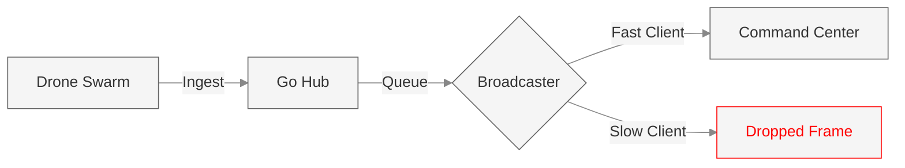

# The Map Engine (RESCUE-ALPHA)
### High-Concurrency Golang WebSocket Hub

The Map Engine is the industrial-grade synchronization backbone of the RESCUE-ALPHA digital twin. Built in **Go**, it manages the spatial distribution of all entities, processes thermal physics, and broadcasts telemetry to the Command Center with sub-millisecond latency.

---

## Technical Architecture

The engine utilizes a **Non-blocking I/O Hub** pattern inspired by high-frequency trading systems. It decouples message ingestion from broadcasting using Go channels and dropping-queue patterns to ensure zero-pressure telemetry—if a client (e.g., UI) falls behind, the hub drops stale frames rather than slowing down the real-time simulation.



### Key Features
- **Concurrent Client Handling**: Supports separate pools for `Drones` and `UI` clients.
- **Dropping Queue Pattern**: Uses `buffered channels` to prevent slow-client backpressure.
- **Thermal Engine**: A multithreaded physics engine for processing temperature signatures.
- **Occupancy Grid**: A centralized state of passable/blocked cells for drone pathfinding.

---

## Performance Metrics

| Metric | Target | Implementation |
|--------|--------|----------------|
| Telemetry Throughput | 100Hz+ per drone | Optimized JSON marshalling & lxzan/gws |
| Broadcast Latency | <1ms | Channel-based zero-copy broadcasting |
| Concurrency | 1000+ drones | Lightweight Goroutines & Sync Mutexes |

---

## WebSocket Context Data Contracts

The Map Engine operates on a JSON-over-WebSocket protocol. All messages are identified by a `type` field.

### Uplink: Drone → Hub
Drones push state and sensor data to the hub.

| Message Type | Fields | Description |
|--------------|--------|-------------|
| `init_connection` | `drone_id`, `capabilities`, `position` | Initial registration handshake. |
| `send_position` | `x`, `y`, `z`, `spherical`, `eta_ms` | Real-time 3D coordinate and camera vector. |
| `survivor_detected` | `x`, `y`, `z`, `confidence` | Thermal detection event result. |
| `scan_heatmap` | `readings: [{x, y, temp}, ...]` | Raw thermal grid data for UI overlays. |

### Downlink: Hub → UI
The hub broadcasts the mission state to the visualization layer.

| Message Type | Fields | Description |
|--------------|--------|-------------|
| `grid_snapshot` | `blocked: [{x, y, r}, ...]` | Full occupancy grid for initial UI sync. |
| `grid_update` | `x`, `y`, `passable: bool` | Incremental updates to disaster zone rubble. |
| `send_position` | `drone_id`, `x`, `y`, `z`, `battery` | Passthrough telemetry for 3D animation. |

---

## Physics Engine: Thermal Scan

The `/scan` endpoint (HTTP POST) allows drones to query the simulation for thermal signatures.

**Request Schema:**
```json
{
  "x": float,
  "y": float,
  "z": float,
  "radius": int,
  "azimuth": float,
  "fov": float
}
```

**Conical FOV Logic:**
The engine uses **Ray-cast Intersection** to determine which survivors are visible to the drone's sensor. The detected heat signature is calculated based on:
- Distance to target (inverse-square law approximation).
- Angle of incidence relative to the camera's center axis.
- Building occlusion (checking the occupancy grid).

---

## Running the Engine

### Installation
```bash
cd drone-sim-server
go mod download
```

### Execution
```bash
# Run as the central server
go run main.go --server

# Optional: Run a mock drone client for testing
go run main.go -drone
```

### Environment Variables
| Variable | Default | Description |
|----------|---------|-------------|
| `PORT` | `8080` | Hub listening port. |
| `MAP_WS_URL` | `ws://localhost:8080/ws/drone` | Target URL for drone clients. |

---

## Spatial Coordinate System

Map Engine uses a **Cartesian 3D System**:
- **X**: Horizontal East/West [-40 to 40 by default].
- **Y**: Ground Plane North/South [-40 to 40 by default].
- **Z**: Altitude (Vertical) [0 = Ground Level].

*Note: Frontend (Three.js) maps these to (X, Z, Y) respectively for standard 3D rendering.*
