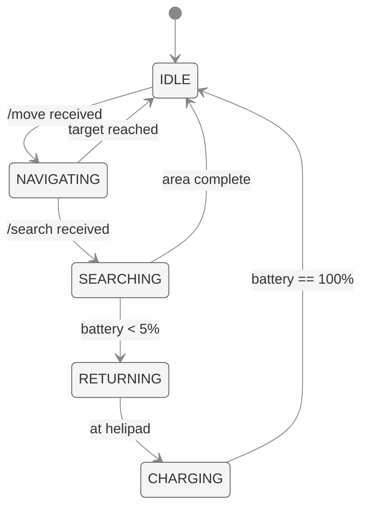
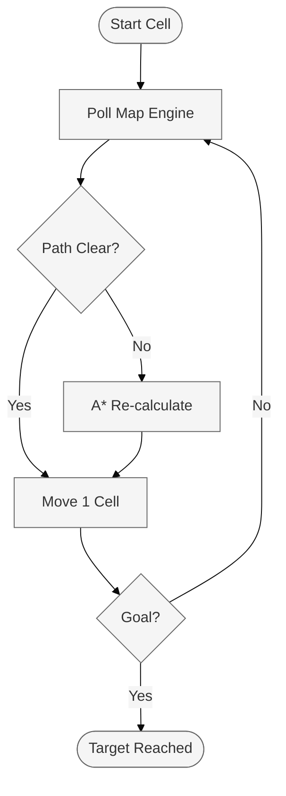

# The Swarm (RESCUE-ALPHA)
### Autonomous Drone Simulation

The Swarm consists of individual Python processes, each simulating a physical rescue drone's hardware constraints, flight physics, and localized sensor logic. Drones operate as autonomous agents that communicate with the **Map Engine** for telemetry and the **Commander Agent** for mission tasking.

---

## Autonomous Simulation Logic

Each drone process manages its own state machine, battery levels, and navigation. To ensure realism, the simulation includes:



- **Atmospheric Physics**: Variable banking angles (roll) and damping during turns.
- **Battery Management**: Dynamic power consumption based on flight distance and sensor load.
- **Heterogeneous Capabilities**: Support for `Scanner` and `Delivery` unit types.

### Primary Capabilities
- **A* Pathfinding**: Real-time obstacle avoidance.
- **Autonomous Sweeping**: Implementation of the boustrophedon (snake) search pattern.
- **Thermal Conical FOV**: Calculation of the sensor's footprint on the ground based on altitude and angle.

---

## Navigation: A* Pathfinding

The drone uses the A* (A-star) algorithm to navigate complex rubble fields. Unlike static pathfinders, RESCUE-ALPHA drones **re-calculate the entire path every single cell movement**.

### Algorithm & Heuristic
The pathfinder minimizes the function $f(n) = g(n) + h(n)$, where:
- **$g(n)$**: The actual cost from the start node to the current node $n$.
- **$h(n)$**: The estimated cost (heuristic) from $n$ to the goal.

RESCUE-ALPHA uses **Manhattan Distance** for $h(n)$ as it is computationally efficient for grid-based movement:
$h(n) = |target\_x - current\_x| + |target\_y - current\_y|$

### Dynamic Awareness & Re-planning
1. **Grid Polling**: Before every cell transition, the drone polls the **Map Engine** for the latest `GridSnapshot`.
2. **Obstacle Detection**: If a previously clear path is now blocked by falling rubble, the drone triggers an immediate re-calculation.
3. **Altitude Overflight**: If flight altitude `z >= 10` (max building height), the drone ignores all building obstacles and travels in a straight line for maximum power efficiency.



---

## Sensor Physics: Conical FOV

The thermal camera's effective search area on the ground is a projection of a 3D cone.

### 3D Conical Geometry
The "Footprint Center" (`fpx`, `fpy`) and radius are determined by:
- **Altitude (`z`)**: Height above ground level.
- **Elevation Angle (`el`)**: Camera tilt (0 = horizontal, -90 = straight down).
- **Field of View (`fov`)**: Angle of the camera's lens.

**Mathematical Footprint:**
$$h\_dist = z / \tan(-elevation\_rad)$$
$$fpx = drone\_x + h\_dist \times \sin(azimuth\_rad)$$
$$fpy = drone\_y - h\_dist \times \cos(azimuth\_rad)$$

---

## Status & Battery Parameters

| Parameter | Value | Description |
|-----------|-------|-------------|
| **Movement Drain** | 0.3% / cell | Power consumed during horizontal transit. |
| **Scan Drain** | 0.8% / scan | High-resolution thermal sensor power load. |
| **Charge Rate** | 5.0% / sec | Fast-charging enabled at the command base helipad. |
| **Low Threshold** | 20.0% | Automatic request for backup handoff. |
| **Critical Threshold** | 5.0% | Emergency return-to-base triggered automatically. |

---

## API Interface (FastAPI)

Each drone hosts an internal REST API for mission control:

| Endpoint | Method | Result |
|----------|--------|--------|
| `/move` | POST | Dispatches drone to (x, y, z) with A* navigation. |
| `/scan` | POST | Triggers a forward-facing 180° thermal sweep. |
| `/search` | POST | Launches an autonomous area sweep (Snake Pattern). |
| `/return` | POST | Navigates home and initiates helipad charging. |

---

## Deployment

Drones are designed to run as isolated processes to simulate a distributed fleet.

### Execution
```bash
# Start a scanner drone (Port 8001)
uvicorn drone.main:app --port 8001

# Start a delivery drone (Port 8002)
DRONE_TYPE=delivery DRONE_PORT=8002 uvicorn drone.main:app --port 8002
```

### Registration
On startup, every drone automatically registers its `UUID`, `Host`, and `Capabilities` with the **Commander Agent** to be catalogued into the active fleet.
