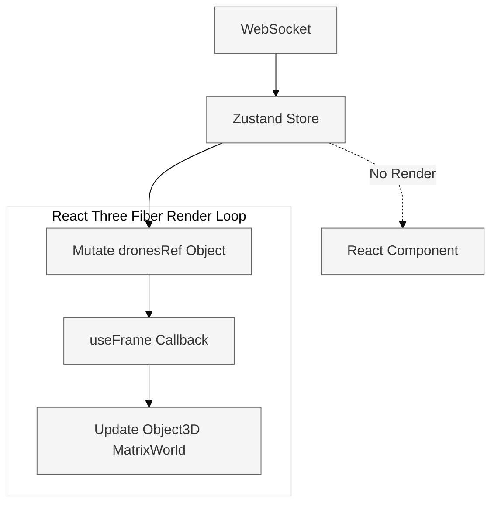
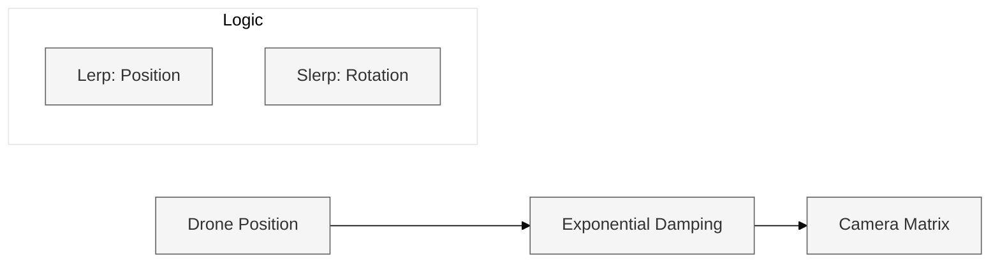

# The Command Center (RESCUE-ALPHA)
### Real-Time 3D Visualization & Mission Control

The Command Center is the high-performance visualization layer of the RESCUE-ALPHA digital twin. Built with **React Three Fiber (R3F)** and **Three.js**, it provides an immersive, data-dense interface for monitoring autonomous drone operations in real-time.

---

## Technical Architecture

The frontend is designed for **High-Frequency Telemetry Synchronization**. To handle 100Hz+ position updates without the UI bottlenecking, the system implements a mixed state-management strategy.

### State Management: Transient Ref Pattern
- **React State (Zustand)**: Used for UI overlays, mission logs, and slow-changing metadata (battery %, status labels).
- **Transient Refs**: Used for 3D object transformations (Position, Rotation, Scale). Components subscribe directly to the `dronesRef` to update Three.js matrices within the `useFrame` render loop, bypassing React's reconciliation for maximum GPU performance.



---

## 3D Environment: Digital Twin

The environment is a photorealistic reconstruction of an earthquake disaster zone.

### Thermal Heatmap Generation
Thermal data is rendered using **InstancedMesh** for high performance.
1. **Data Ingestion**: Hub sends a `scan_heatmap` array of (x, y, temp).
2. **Buffer Management**: The frontend maintains a `HeatmapRef` float32 array.
3. **Color Mapping**: Temperatures are mapped to a custom HSL gradient (Cold Blue -> Hot Red).
4. **Instanced Rendering**: A single draw call renders up to 10,000 thermal tiles simultaneously.

---

## Triple-View Camera System

The `CameraController` provides three synchronized perspectives. It uses **Lerp (Linear Interpolation)** and **Slerp (Spherical Linear Interpolation)** for smooth transitions.



| View Mode | Perspective | Description |
|-----------|-------------|-------------|
| **GLOBAL** | Orbit | Free-form exploration of the entire volume. |
| **FOLLOW** | Track | Spring-arm camera tracking with high-damped look-at. |
| **PILOT** | Cockpit | Locked-view with screen-jitter and atmospheric roll synchronization. |

---

## UI/UX: Bento Bridge Interface

The overlay utilizes a **Glass-Bridge Bento UI** design, optimized for high-density information display.

### Functional Modules
- **Fleet Sidebar**: Real-time health monitor and selection for all active drones.
- **Tactical HUD**: 2D overlay providing compass heading, altitude ladder, and targeting reticles.
- **Mission Log**: Intelligent, scroll-anchored stream of LLM reasoning and mission events.
- **Intel Drawer**: Deep-dive telemetry for the selected drone (spherical coords, sensor status).

---

## Setup & Running

### Installation
```bash
cd frontend
npm install
```

### Execution
```bash
npm run dev
```
The interface will be available at `http://localhost:5173`.

### Environment Variables
| Variable | Default | Description |
|----------|---------|-------------|
| `VITE_WS_URL` | `ws://localhost:8080/ws/ui` | Destination for Map Engine telemetry. |
| `VITE_BACKEND_URL` | `http://localhost:8000` | Target for Mission Control REST API. |

---

## Spatial Coordinate Mapping

To maintain parity with the **Map Engine** (Go) and **Swarm** (Python), the frontend performs a coordinate transformation:

| Logic | RESCUE-ALPHA (Go/Py) | Three.js (React) |
|-------|--------------------|-------------------|
| **East/West** | `X` | `X` |
| **Altitude** | `Z` | `Y` |
| **North/South** | `Y` | `Z` |
